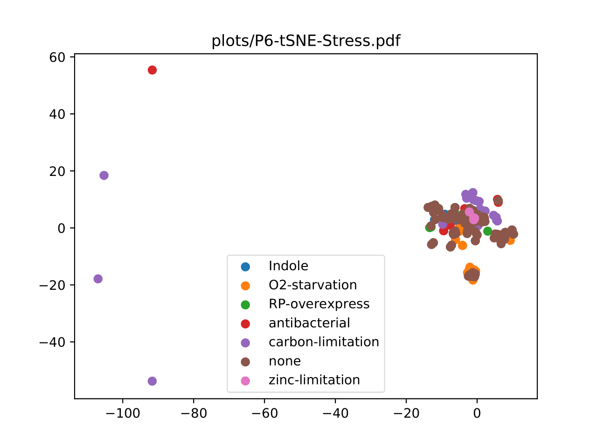

# Phenotype Predictor
> Predict and analyze the phenotypic and environmental characteristics of E. coli through various machine learning tools.

## Table of contents
* [ML Topics Used](#ml-topics-used)
* [Background](#background)
* [Contact](#contact)

## ML Topics Used
* **Predictors**: Lasso regression, SVM
* **Exploratory Data Analysis**: PCA, t-SNE
* **Performance Metrics**: ROC, PR
* **Statistics**: bootstrap, confidence interval

## Background
This is a final assignment that I completed for my machine learning course, which tested my understanding of various topics. Each problem number describes what I was suppose to do. The plots and problems are listened by their corresponding number (i.e. `P4.py` corresponds to `plots/P4-PR.png, plots/P4-ROC.png`).

### Problems
1. Create a predictor of the bacterial growth attribute by using only the expression of the genes
as attributes. Not all genes are informative for this task, so use a regularized regression technique (e.g. lasso, ridge or elastic net) and explain what it does (we discussed these techniques in class, but you might have to read some more on how each method works). Which
one is the optimal constrained parameter value (usually denoted by λ)? Report the number
of features that have non-zero coefficients and the 5-fold cross-validation generalization error of the technique.

2. Extend your predictor to report the confidence interval of the prediction by using the bootstrapping method. Clearly state the methodology and your assumptions. (You need not report the confidence interval here, you only need add that functionality to your code)

3. Use your bootstrap model from 2 to find the confidence interval of predicted growth for a
bacterium whose genes are expressed exactly at the mean expression value. (Note: for each
gene, there is a corresponding mean expression value)

4. Create four separate SVM classifiers to categorize the strain type, medium type, environmental and gene perturbation, given all the gene transcriptional profiles. The classifier
should select as features a small subset of the genes, either by performing feature selection
(wrapper method) or by using only the non-zero weighted features from the regularized regression technique of the first aim. For each classifier (4 total) report the number of features
and the classification performance through 5-fold cross-validation by plotting the ROC and
PR curves and reporting the AUC/AUPRC values.

5. Create one composite SVM classifier to simultaneously predict medium and environmental
perturbations and report the 10-fold cross-validation AUC/AUPRC value. Does this classifier
perform better or worse than the two individual classifiers together for these predictions?
That is, are we better off building one composite or two separate classifiers to simultaneously predict these two features? What is the baseline prediction performance (null hypothesis)?

6. Reduce the dimensionality of gene expression profiles (i.e. last 4496 columns) to two dimensions only using both Principal Component Analysis (PCA) and t-SNE. Visualize the dataset
in 2-d space using PCA and t-SNE separately (report two plots).

7. Redo the problem 4 but instead of feature selection, use dimensionality reduction results
of problem 6 and report the 10-fold cross validation AUC/AUPRC values. For each of the
four classifiers, what is the best pre-processing approach (feature selection, PCA or t-SNE)?

## Contact
Created by [@spencerpham](https://www.spencerpham.dev/) - feel free to contact me!
